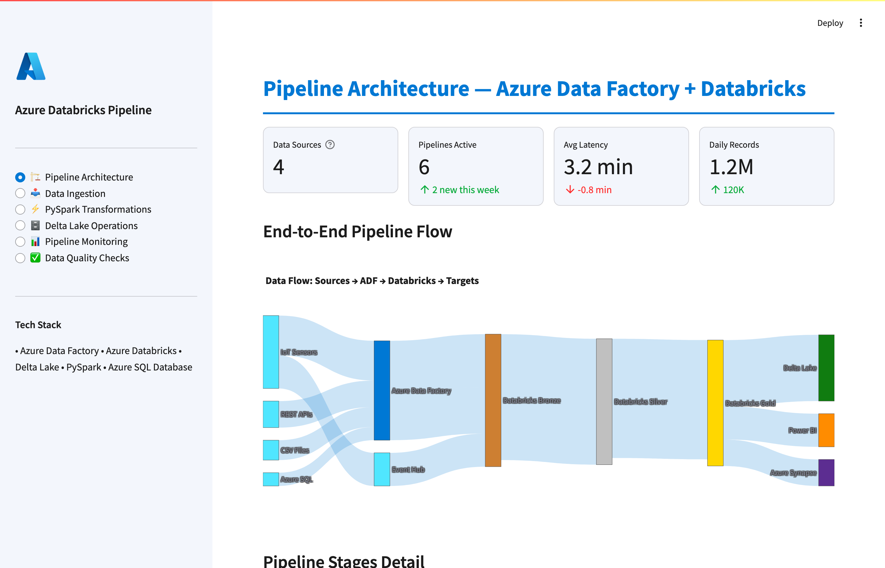

# Azure Databricks Pipeline Demo

An interactive Streamlit application demonstrating an end-to-end **Azure Databricks + Delta Lake ETL pipeline** — from raw data ingestion through PySpark transformations to production-grade data quality monitoring.

**[View Live Demo]([https://anualli-demo-azure-databricks-pipeline.streamlit.app](https://anualli-demo-azure-databricks-pipeline-app-or1vry.streamlit.app/))**

---

## What This Project Demonstrates

This demo simulates a real-world IoT data pipeline built on Azure Databricks, showcasing:

- **Medallion Architecture** (Bronze → Silver → Gold) for structured data processing
- **PySpark Transformations** with interactive code examples for joins, aggregations, and window functions
- **Delta Lake Operations** including MERGE/UPSERT, Time Travel, and optimized partitioning
- **Pipeline Monitoring** with execution timelines, throughput tracking, and activity logging
- **Data Quality Checks** using Delta Live Tables (DLT) expectations with pass/fail validation rules

The app generates realistic synthetic IoT sensor data and walks through each stage of the pipeline with live visualizations.

---

## Screenshots

### Pipeline Architecture
End-to-end Sankey diagram showing data flow from Azure Event Hub through Databricks to the Gold layer.



### Data Ingestion
Raw IoT data profiling with distribution charts, null analysis, and data type breakdown.


### PySpark Transformations
Interactive transformation explorer with live PySpark code snippets for joins, aggregations, and window functions.


### Delta Lake Operations
MERGE/UPSERT operations, Time Travel queries, and partition optimization strategies.


### Pipeline Monitoring
Execution timeline, throughput metrics, and real-time activity log.


### Data Quality Checks
Gauge charts for quality scores, validation rules with pass/fail status, and DLT expectations code.


---

## Tech Stack

- **Cloud:** Azure Databricks, Azure Data Factory, Azure Event Hub
- **Processing:** PySpark, Delta Lake, Delta Live Tables
- **Visualization:** Streamlit, Plotly
- **Languages:** Python, SQL, PySpark

## Run Locally

```bash
pip install -r requirements.txt
streamlit run app.py
```

## License

MIT
